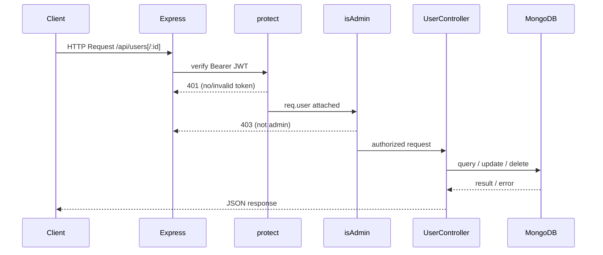

# Design Document: Admin User Management

## Overview

This feature adds three admin-only REST endpoints to the Techhub backend that allow administrators to list all users, update a user's role, and delete a user account. All endpoints are protected by the existing `protect` + `isAdmin` middleware chain and include a self-modification guard to prevent admins from accidentally locking themselves out.

The implementation introduces two new files:
- `controllers/userController.js` — handler functions for the three operations
- `routes/userRoutes.js` — Express router that wires middleware and handlers

One existing file is modified:
- `server.js` — mounts `userRoutes` at `/api/users`

The design follows the same patterns already established in the codebase (e.g., `productController.js`, `authController.js`): async/await handlers, `next(err)` for error propagation, and a shared `buildPublicProfile` helper to strip `passwordHash` from responses.

---

## Architecture



The route stack for every user management endpoint is:

```
protect → isAdmin → [getAllUsers | updateUserRole | deleteUser]
```

---

## Components and Interfaces

### `controllers/userController.js`

#### `buildPublicProfile(user)`

A private helper (not exported) that maps a Mongoose user document to the `Public_Profile` shape, explicitly omitting `passwordHash` and the reset-token fields.

```javascript
/**
 * Maps a Mongoose user document to a safe public profile object.
 * @param {Object} user - Mongoose User document
 * @returns {Object} Public_Profile
 */
const buildPublicProfile = (user) => ({
  _id:        user._id,
  fullName:   user.fullName,
  username:   user.username,
  email:      user.email,
  phone:      user.phone,
  address:    user.address,
  city:       user.city,
  postalCode: user.postalCode,
  role:       user.role,
  createdAt:  user.createdAt,
  updatedAt:  user.updatedAt,
});
```

> **Design decision**: `buildPublicProfile` is defined locally in `userController.js` rather than shared with `authController.js` to keep modules independent. If the profile shape diverges in the future, each controller can evolve independently. The `updatedAt` field is included here (unlike `authController.js`) because admin tooling benefits from seeing when a user record was last modified.

---

#### `getAllUsers(req, res, next)`

```javascript
/**
 * GET /api/users
 * Returns all users as Public_Profile objects.
 * Supports optional case-insensitive search on fullName and email
 * via the `search` query parameter.
 *
 * @param {import('express').Request}  req
 * @param {import('express').Response} res
 * @param {import('express').NextFunction} next
 */
const getAllUsers = async (req, res, next) => {
  try {
    // Build query filter
    // PSEUDOCODE:
    //   filter = {}
    //   IF req.query.search is present AND non-empty:
    //     regex = new RegExp(req.query.search, 'i')
    //     filter.$or = [{ fullName: regex }, { email: regex }]
    //
    //   users = await User.find(filter).select('-passwordHash')
    //   return res.status(200).json(users.map(buildPublicProfile))
  } catch (err) {
    next(err);
  }
};
```

**Notes**:
- `.select('-passwordHash')` is used as a defence-in-depth measure; `buildPublicProfile` also omits the field explicitly.
- The search regex is built from the raw query string. No escaping is applied in the pseudocode above; the implementation should escape special regex characters to prevent ReDoS (see Error Handling).

---

#### `updateUserRole(req, res, next)`

```javascript
/**
 * PUT /api/users/:id/role
 * Updates the role of the target user.
 * Guards against self-modification.
 *
 * @param {import('express').Request}  req  - req.body.role, req.params.id, req.user
 * @param {import('express').Response} res
 * @param {import('express').NextFunction} next
 */
const updateUserRole = async (req, res, next) => {
  try {
    // PSEUDOCODE:
    //   CONST { role } = req.body
    //   CONST { id }   = req.params
    //
    //   // Self-modification guard
    //   IF req.user._id.toString() === id:
    //     return res.status(403).json({ message: 'You cannot modify your own role' })
    //
    //   // Role validation
    //   IF role is not 'user' AND role is not 'admin':
    //     return res.status(400).json({ message: 'Role must be either "user" or "admin"' })
    //
    //   user = await User.findByIdAndUpdate(
    //     id,
    //     { role },
    //     { new: true, runValidators: true }
    //   ).select('-passwordHash')
    //
    //   IF user is null:
    //     return res.status(404).json({ message: 'User not found' })
    //
    //   return res.status(200).json(buildPublicProfile(user))
  } catch (err) {
    next(err);
  }
};
```

**Notes**:
- The self-modification check runs **before** the DB query to avoid an unnecessary round-trip.
- Role validation runs before the DB query for the same reason.
- `runValidators: true` ensures the Mongoose schema enum constraint (`['user', 'admin']`) is enforced at the DB layer as a second line of defence.

---

#### `deleteUser(req, res, next)`

```javascript
/**
 * DELETE /api/users/:id
 * Deletes the target user account.
 * Guards against self-deletion.
 *
 * @param {import('express').Request}  req  - req.params.id, req.user
 * @param {import('express').Response} res
 * @param {import('express').NextFunction} next
 */
const deleteUser = async (req, res, next) => {
  try {
    // PSEUDOCODE:
    //   CONST { id } = req.params
    //
    //   // Self-deletion guard
    //   IF req.user._id.toString() === id:
    //     return res.status(403).json({ message: 'You cannot delete your own account' })
    //
    //   user = await User.findByIdAndDelete(id)
    //
    //   IF user is null:
    //     return res.status(404).json({ message: 'User not found' })
    //
    //   return res.status(200).json({ message: 'User deleted successfully' })
  } catch (err) {
    next(err);
  }
};
```

---

### `routes/userRoutes.js`

```javascript
const router  = require('express').Router();
const { protect, isAdmin } = require('../middleware/authMiddleware');
const { getAllUsers, updateUserRole, deleteUser } = require('../controllers/userController');

// All routes require authentication + admin role
router.get('/',        protect, isAdmin, getAllUsers);
router.put('/:id/role', protect, isAdmin, updateUserRole);
router.delete('/:id',  protect, isAdmin, deleteUser);

module.exports = router;
```

**Design decision**: `protect` and `isAdmin` are applied per-route rather than via `router.use()`. This is consistent with the existing `productRoutes.js` pattern and makes the middleware chain explicit and easy to audit at a glance.

---

### `server.js` (modification)

Add the following import and mount alongside the existing routes:

```javascript
// New import (add with the other route requires)
const userRoutes = require('./routes/userRoutes');

// New mount (add after the existing app.use('/api/orders', ...) line)
app.use('/api/users', userRoutes);
```

---

## Data Models

No new Mongoose models are introduced. The feature reads from and writes to the existing `User` model.

### User Schema (existing, relevant fields)

| Field        | Type   | Notes                                      |
|--------------|--------|--------------------------------------------|
| `_id`        | ObjectId | Auto-generated primary key               |
| `fullName`   | String | Required                                   |
| `username`   | String | Required, unique                           |
| `email`      | String | Required, unique                           |
| `passwordHash` | String | Required — **never returned to clients** |
| `phone`      | String | Required                                   |
| `address`    | String | Required                                   |
| `city`       | String | Required                                   |
| `postalCode` | String | Required                                   |
| `role`       | String | Enum: `['user', 'admin']`, default `'user'` |
| `createdAt`  | Date   | Auto-managed by Mongoose timestamps        |
| `updatedAt`  | Date   | Auto-managed by Mongoose timestamps        |

### Public_Profile shape (response DTO)

All three endpoints return user data in this shape (passwordHash excluded):

```json
{
  "_id":        "ObjectId",
  "fullName":   "string",
  "username":   "string",
  "email":      "string",
  "phone":      "string",
  "address":    "string",
  "city":       "string",
  "postalCode": "string",
  "role":       "user | admin",
  "createdAt":  "ISO 8601 date",
  "updatedAt":  "ISO 8601 date"
}
```

---

## Correctness Properties

*A property is a characteristic or behavior that should hold true across all valid executions of a system — essentially, a formal statement about what the system should do. Properties serve as the bridge between human-readable specifications and machine-verifiable correctness guarantees.*

**Property Reflection**: After prework analysis, properties 2.4 (self-modification guard for role update) and 3.2 (self-modification guard for delete) share the same structural pattern — "for any admin, targeting their own ID returns 403 with a specific message." These are kept as separate properties because the messages and endpoints differ, but they are consolidated into a single "self-modification guard" property that covers both operations.

---

### Property 1: getAllUsers returns all users as Public_Profile objects

*For any* set of user documents in the database, a GET request to `/api/users` (without a search parameter) SHALL return an array whose length equals the number of users in the database, and every element SHALL be a valid Public_Profile object containing no `passwordHash` field.

**Validates: Requirements 1.1, 1.4**

---

### Property 2: Search filter is correct and complete

*For any* non-empty search string and any set of user documents, a GET request to `/api/users?search=<string>` SHALL return exactly the subset of users whose `fullName` or `email` contains the search string (case-insensitive) — no matching user is omitted, and no non-matching user is included.

**Validates: Requirements 1.2, 1.3**

---

### Property 3: passwordHash is never present in any response

*For any* user document (regardless of which endpoint is called), the JSON response body SHALL never contain a `passwordHash` field at any nesting level.

**Validates: Requirements 1.4**

---

### Property 4: Role validation rejects all non-enum values

*For any* string value that is not `'user'` or `'admin'` (including the empty string, `null`, `undefined`, and arbitrary random strings), a PUT request to `/api/users/:id/role` with that value SHALL return HTTP 400 with a descriptive error message, and the user's role in the database SHALL remain unchanged.

**Validates: Requirements 2.2, 2.3**

---

### Property 5: Self-modification guard fires for any admin identity

*For any* authenticated admin user, a PUT request to `/api/users/:id/role` or a DELETE request to `/api/users/:id` where `:id` equals the admin's own `_id` SHALL return HTTP 403 with the appropriate message (`'You cannot modify your own role'` or `'You cannot delete your own account'`), regardless of the role value or any other request parameters.

**Validates: Requirements 2.4, 3.2**

---

### Property 6: Successful role update returns updated Public_Profile

*For any* existing user ID (that is not the requesting admin's own ID) and any valid role value (`'user'` or `'admin'`), a PUT request to `/api/users/:id/role` SHALL return HTTP 200 with a Public_Profile object whose `role` field equals the submitted role value and whose `passwordHash` field is absent.

**Validates: Requirements 2.1, 1.4**

---

### Property 7: Successful delete returns success message

*For any* existing user ID (that is not the requesting admin's own ID), a DELETE request to `/api/users/:id` SHALL return HTTP 200 with `{ message: 'User deleted successfully' }`, and the user SHALL no longer exist in the database.

**Validates: Requirements 3.1**

---

## Error Handling

### Strategy

All three controller functions follow the same error-handling pattern already established in the codebase:

1. **Validation errors** (bad input, self-modification) — handled inline with early `return res.status(4xx).json(...)` before any DB call.
2. **Not-found errors** — detected by checking the return value of `findByIdAndUpdate` / `findByIdAndDelete` for `null`.
3. **Database errors** — caught by the `try/catch` block and forwarded to Express's global error handler via `next(err)`.
4. **CastError** (invalid ObjectId format) — the global error handler in `server.js` already converts `CastError` to HTTP 400 `{ message: 'Invalid ID format' }`, so no per-controller handling is needed.

### ReDoS Prevention

The `search` query parameter in `getAllUsers` is used to build a MongoDB regex query. To prevent Regular Expression Denial of Service (ReDoS), special regex characters in the search string must be escaped before constructing the `RegExp` object:

```javascript
// Escape special regex characters
const escaped = req.query.search.replace(/[.*+?^${}()|[\]\\]/g, '\\$&');
const regex = new RegExp(escaped, 'i');
```

### Error Response Shape

All error responses follow the existing convention:

```json
{ "message": "<human-readable description>" }
```

### HTTP Status Code Summary

| Scenario                              | Status |
|---------------------------------------|--------|
| Success (list / update / delete)      | 200    |
| Invalid role value / missing field    | 400    |
| Invalid ObjectId format (CastError)   | 400    |
| No/invalid Bearer token               | 401    |
| Non-admin user / self-modification    | 403    |
| User not found                        | 404    |
| Database / unexpected error           | 500    |

---

## Testing Strategy

### Dual Testing Approach

Both unit tests (example-based) and property-based tests are used. Unit tests cover specific scenarios, integration points, and error conditions. Property tests verify universal invariants across a wide range of generated inputs.

### Property-Based Testing Library

**[fast-check](https://github.com/dubzzz/fast-check)** is the recommended PBT library for this Node.js/JavaScript project. It integrates cleanly with Jest (the standard test runner for Express projects) and provides rich arbitraries for generating strings, objects, and arrays.

Each property test must run a **minimum of 100 iterations** (fast-check default is 100; configure via `{ numRuns: 100 }`).

Each property test must be tagged with a comment in the format:
`// Feature: admin-user-management, Property <N>: <property_text>`

### Unit Tests (Example-Based)

Focus on concrete scenarios not covered by property tests:

- **1.5** — `getAllUsers` calls `next(err)` when `User.find()` rejects
- **2.5** — `updateUserRole` returns 404 when `findByIdAndUpdate` returns `null`
- **2.6** — `updateUserRole` calls `next(err)` when `findByIdAndUpdate` rejects
- **3.3** — `deleteUser` returns 404 when `findByIdAndDelete` returns `null`
- **3.4** — `deleteUser` calls `next(err)` when `findByIdAndDelete` rejects
- **4.1 / 4.3** — Unauthenticated request to any endpoint returns 401
- **4.2 / 4.4** — Non-admin authenticated request to any endpoint returns 403
- **5.1** — Smoke: all three endpoints are reachable (not 404) in the mounted app

### Property Tests

| Property | Test Description | Arbitraries |
|----------|-----------------|-------------|
| P1 | getAllUsers returns all users | `fc.array(fc.record({ fullName, email, ... }))` |
| P2 | Search filter is correct and complete | `fc.tuple(fc.array(userArb), fc.string())` |
| P3 | passwordHash absent from all responses | `fc.array(userArb)` with passwordHash included |
| P4 | Role validation rejects non-enum values | `fc.string().filter(s => s !== 'user' && s !== 'admin')` |
| P5 | Self-modification guard fires | `fc.record({ _id: fc.uuid() })` for admin identity |
| P6 | Successful role update returns updated profile | `fc.tuple(userIdArb, fc.constantFrom('user', 'admin'))` |
| P7 | Successful delete returns success message | `fc.string()` for user ID (mocked DB) |

### Test File Location

```
Techhub-v1/
  __tests__/
    userController.unit.test.js    ← unit/example-based tests
    userController.property.test.js ← property-based tests (fast-check)
```
