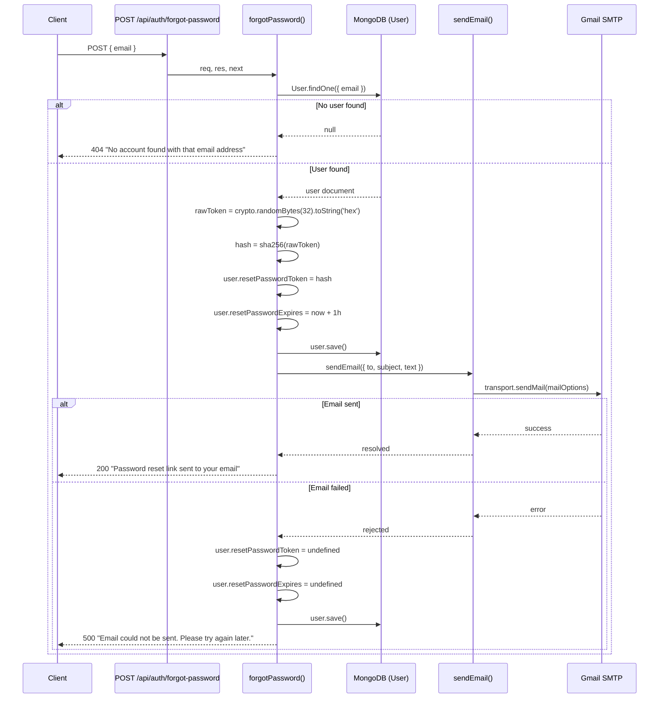
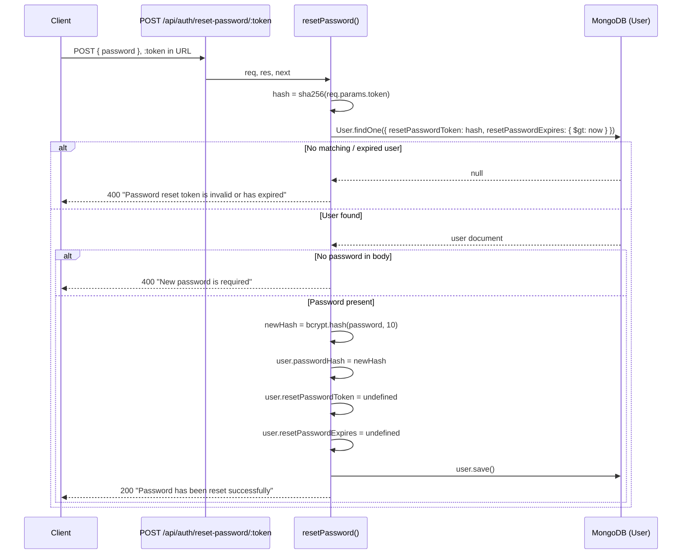

# Design Document — Password Reset

## Overview

This document describes the technical design for adding a secure, token-based password reset flow to the Techhub-v1 Express/MongoDB backend.

The flow has two phases:

1. **Forgot Password** — the user submits their email address. The system generates a cryptographically random 32-byte token, stores its SHA-256 hash in the database with a 1-hour expiry, and emails the raw token to the user as a clickable link.
2. **Reset Password** — the user follows the link (which carries the raw token) and submits a new password. The system re-hashes the raw token, looks up the matching user record, validates the expiry, updates the password hash, and clears the reset fields.

The design is intentionally minimal: it adds two fields to the existing `User` model, one new utility module (`utils/sendEmail.js`), two new controller functions in the existing `authController.js`, and two new routes on the existing auth router. No new infrastructure or third-party services beyond nodemailer are introduced.

---

## Architecture





---

## Components and Interfaces

### New / Modified Files

| File | Change |
|---|---|
| `models/user.js` | Add `resetPasswordToken` and `resetPasswordExpires` fields |
| `utils/sendEmail.js` | **New** — reusable nodemailer Gmail transport |
| `controllers/authController.js` | Add `forgotPassword` and `resetPassword` exports |
| `routes/authRoutes.js` | Register two new POST routes |
| `.env` | Add `GMAIL_USER` and `GMAIL_APP_PASSWORD` placeholder entries |

### `utils/sendEmail.js` Interface

```js
/**
 * Send a transactional email via Gmail.
 * @param {{ to: string, subject: string, text: string }} options
 * @returns {Promise<void>}  Resolves on success, rejects with transport error on failure.
 */
async function sendEmail({ to, subject, text }) { ... }

module.exports = sendEmail;
```

The function creates a fresh nodemailer transport on every call (stateless). This keeps the module simple and avoids connection-state issues in long-running processes.

### `authController.js` — New Exports

```js
// Existing exports remain unchanged
module.exports = { register, login, forgotPassword, resetPassword };
```

`forgotPassword` and `resetPassword` follow the same `async (req, res, next)` signature as the existing handlers and delegate unexpected errors to `next(err)` for the global error handler.

---

## Data Models

### User Schema — Added Fields

```js
resetPasswordToken:   { type: String },   // SHA-256 hex digest of the raw token
resetPasswordExpires: { type: Date },      // UTC expiry timestamp (now + 1 hour)
```

Both fields have no `required` constraint and no `default` value, so they are `undefined` on newly registered users and on users who have never requested a reset. Mongoose omits `undefined` fields from the stored document, keeping the collection lean.

Full updated schema shape:

```js
{
  fullName:             String (required),
  username:             String (required, unique),
  email:                String (required, unique),
  passwordHash:         String (required),
  phone:                String (required),
  address:              String (required),
  city:                 String (required),
  postalCode:           String (required),
  role:                 String (enum: ['user','admin'], default: 'user'),
  resetPasswordToken:   String,   // ← new
  resetPasswordExpires: Date,     // ← new
  createdAt:            Date (auto),
  updatedAt:            Date (auto),
}
```

### Token Lifecycle

| State | `resetPasswordToken` | `resetPasswordExpires` |
|---|---|---|
| Newly registered | `undefined` | `undefined` |
| After `forgotPassword` (success) | SHA-256 hex string | `Date.now() + 3_600_000` |
| After `resetPassword` (success) | `undefined` | `undefined` |
| After `forgotPassword` (email failure) | `undefined` | `undefined` |

---

## Controller Logic

### `forgotPassword` Pseudocode

```
forgotPassword(req, res, next):
  if req.body.email is missing:
    return 400 "Email is required"

  user = await User.findOne({ email: req.body.email })
  if user is null:
    return 404 "No account found with that email address"

  rawToken = crypto.randomBytes(32).toString('hex')          // 64-char hex string
  tokenHash = crypto.createHash('sha256').update(rawToken).digest('hex')

  user.resetPasswordToken   = tokenHash
  user.resetPasswordExpires = new Date(Date.now() + 60 * 60 * 1000)  // +1 hour
  await user.save()

  resetURL = `${process.env.FRONT_URL}/reset-password/${rawToken}`
  try:
    await sendEmail({
      to:      user.email,
      subject: "Password Reset Request",
      text:    `You requested a password reset.\n\nClick the link below to reset your password:\n${resetURL}\n\nThis link expires in 1 hour.\n\nIf you did not request this, please ignore this email.`
    })
    return 200 "Password reset link sent to your email"
  catch err:
    user.resetPasswordToken   = undefined
    user.resetPasswordExpires = undefined
    await user.save()
    return 500 "Email could not be sent. Please try again later."
```

### `resetPassword` Pseudocode

```
resetPassword(req, res, next):
  tokenHash = crypto.createHash('sha256').update(req.params.token).digest('hex')

  user = await User.findOne({
    resetPasswordToken:   tokenHash,
    resetPasswordExpires: { $gt: Date.now() }
  })
  if user is null:
    return 400 "Password reset token is invalid or has expired"

  if req.body.password is missing:
    return 400 "New password is required"

  user.passwordHash         = await bcrypt.hash(req.body.password, 10)
  user.resetPasswordToken   = undefined
  user.resetPasswordExpires = undefined
  await user.save()

  return 200 "Password has been reset successfully"
```

---

## Route Registration

Two routes are added to `routes/authRoutes.js`. Neither requires the `protect` middleware because the user is unauthenticated at this point.

```js
// routes/authRoutes.js (updated)
const router = require('express').Router();
const authController = require('../controllers/authController');

router.post('/register',              authController.register);
router.post('/login',                 authController.login);
router.post('/forgot-password',       authController.forgotPassword);   // ← new
router.post('/reset-password/:token', authController.resetPassword);    // ← new

module.exports = router;
```

The routes are mounted at `/api/auth` in `server.js` (no change to `server.js` required), so the full paths are:

- `POST /api/auth/forgot-password`
- `POST /api/auth/reset-password/:token`

---

## Environment Variable Usage

| Variable | Purpose | Example placeholder |
|---|---|---|
| `GMAIL_USER` | Gmail address used as the SMTP sender and authenticator | `your-email@gmail.com` |
| `GMAIL_APP_PASSWORD` | Gmail App Password (not the account password) | `xxxx xxxx xxxx xxxx` |
| `FRONT_URL` | Base URL of the frontend, used to construct the reset link | `http://localhost:3000` |
| `JWT_SECRET` | Existing — unchanged | *(already present)* |

`FRONT_URL` is already consumed by the CORS configuration in `server.js`; it is reused here for the reset URL construction.

`.env` additions:

```
# Password Reset — Gmail transport
GMAIL_USER=your-email@gmail.com
GMAIL_APP_PASSWORD=xxxx xxxx xxxx xxxx
```

---

## Correctness Properties

*A property is a characteristic or behavior that should hold true across all valid executions of a system — essentially, a formal statement about what the system should do. Properties serve as the bridge between human-readable specifications and machine-verifiable correctness guarantees.*

The password reset feature contains several pure or near-pure functions (token generation, SHA-256 hashing, URL construction, bcrypt hashing, token field cleanup) that are well-suited to property-based testing. The following properties are derived from the acceptance criteria prework analysis.

**Property Reflection:**
- Requirements 3.3 and 3.4 / 4.1 both concern the token-to-hash relationship. They are consolidated into a single round-trip property (Property 2) that subsumes the format check.
- Requirements 3.5 and 4.6 both concern field state after handler execution. They are kept separate because they test different handlers and different state transitions.
- Requirements 3.9 and 4.6 both concern token field cleanup but under different conditions (email failure vs. successful reset); they are kept separate.

---

### Property 1: Token generation always produces a valid 64-character hex string

*For any* invocation of `crypto.randomBytes(32).toString('hex')`, the result SHALL always be a string of exactly 64 lowercase hexadecimal characters (`[0-9a-f]{64}`).

**Validates: Requirements 3.3**

---

### Property 2: Token hashing is deterministic and produces a consistent round-trip

*For any* raw token string, computing `sha256(rawToken)` during `forgotPassword` and then computing `sha256(sameRawToken)` during `resetPassword` SHALL always produce identical 64-character hex digests, ensuring the stored hash always matches the re-computed hash for the same token.

**Validates: Requirements 3.4, 4.1**

---

### Property 3: Reset token expiry is always set to approximately one hour in the future

*For any* invocation of `forgotPassword` that successfully finds a user, the stored `resetPasswordExpires` value SHALL always be within a 5-second window of `Date.now() + 3_600_000` milliseconds at the time of the save.

**Validates: Requirements 3.5**

---

### Property 4: Reset URL always embeds the raw token under the correct path

*For any* raw token string and any value of `FRONT_URL`, the reset URL constructed by `forgotPassword` SHALL always equal `${FRONT_URL}/reset-password/${rawToken}`, and the email `text` body SHALL always contain that URL.

**Validates: Requirements 3.7**

---

### Property 5: Email send failure always results in token fields being cleared

*For any* user and any `sendEmail` rejection reason, after `forgotPassword` handles the rejection, both `user.resetPasswordToken` and `user.resetPasswordExpires` SHALL be `undefined` on the saved document.

**Validates: Requirements 3.9**

---

### Property 6: Successful password reset always clears token fields

*For any* valid reset token and any new password string, after `resetPassword` completes successfully, both `user.resetPasswordToken` and `user.resetPasswordExpires` SHALL be `undefined` on the saved document.

**Validates: Requirements 4.6**

---

### Property 7: New password hash always verifies against the original plaintext

*For any* non-empty password string submitted to `resetPassword`, the `bcrypt.hash(password, 10)` result stored in `user.passwordHash` SHALL always satisfy `bcrypt.compare(password, storedHash) === true`.

**Validates: Requirements 4.5**

---

## Error Handling Strategy

All errors follow the existing project conventions established in `server.js` and `authController.js`.

### Validation Errors (4xx — returned directly)

| Condition | HTTP Status | Message |
|---|---|---|
| Missing `email` in forgot-password body | 400 | `"Email is required"` |
| No user found for email | 404 | `"No account found with that email address"` |
| Token invalid or expired | 400 | `"Password reset token is invalid or has expired"` |
| Missing `password` in reset-password body | 400 | `"New password is required"` |

### Infrastructure Errors (handled inline)

| Condition | Behaviour |
|---|---|
| `sendEmail` rejects | Clear token fields, save user, return 500 with `"Email could not be sent. Please try again later."` |

The email failure is handled inline (not delegated to `next(err)`) because the system must perform a compensating write (clearing the token fields) before responding. Delegating to the global error handler would skip that cleanup.

### Unexpected Errors (delegated to global handler)

Any `await` that throws unexpectedly (e.g., a MongoDB network error during `user.save()`) is caught by the `try/catch` wrapping each handler and forwarded to `next(err)`. The global error handler in `server.js` returns 500 with `"Internal server error"` in production or the full stack trace in development.

---

## Testing Strategy

### Dual Testing Approach

Both unit/example-based tests and property-based tests are used. Unit tests cover specific scenarios, integration points, and error conditions. Property tests verify universal correctness guarantees across a wide input space.

### Property-Based Testing Library

**fast-check** (npm: `fast-check`) is the recommended library for this project. It is the most actively maintained JavaScript PBT library, works with any test runner, and has first-class TypeScript support. Each property test must run a minimum of **100 iterations**.

Install: `npm install --save-dev fast-check jest`

Tag format for each property test:
```
// Feature: password-reset, Property <N>: <property_text>
```

### Unit / Example-Based Tests

Focus areas:

- **`utils/sendEmail.js`**: Mock `nodemailer.createTransport`; verify transport is created with correct Gmail config; verify `from` field; verify resolve on success; verify reject on transport error.
- **`forgotPassword` handler**: Mock `User.findOne`, `user.save`, and `sendEmail`; cover 400 (missing email), 404 (no user), 200 (success), 500 (email failure with token cleanup).
- **`resetPassword` handler**: Mock `User.findOne` and `user.save`; cover 400 (invalid/expired token), 400 (missing password), 200 (success with field cleanup).
- **Route registration**: Use `supertest` to verify both routes return non-404 responses and do not require an `Authorization` header.

### Property-Based Tests

| Property | Test Description | Arbitraries |
|---|---|---|
| Property 1 | Token format | `fc.integer()` seeded to drive `crypto.randomBytes` via mock, or simply call the real function N times |
| Property 2 | SHA-256 round-trip consistency | `fc.hexaString({ minLength: 1 })` as raw token input |
| Property 3 | Expiry within 1-hour window | `fc.record({ email: fc.emailAddress() })` with mocked user |
| Property 4 | Reset URL construction | `fc.hexaString({ minLength: 64, maxLength: 64 })` for token, `fc.webUrl()` for FRONT_URL |
| Property 5 | Token cleanup on email failure | `fc.string()` for rejection reason, mocked user |
| Property 6 | Token cleanup on successful reset | `fc.hexaString({ minLength: 64, maxLength: 64 })` for token, `fc.string({ minLength: 1 })` for password |
| Property 7 | bcrypt round-trip | `fc.string({ minLength: 1, maxLength: 72 })` for password (bcrypt max is 72 bytes) |

### Test File Layout

```
Techhub-v1/
  __tests__/
    unit/
      sendEmail.test.js
      forgotPassword.test.js
      resetPassword.test.js
    property/
      tokenGeneration.property.test.js
      tokenHashing.property.test.js
      resetExpiry.property.test.js
      resetUrl.property.test.js
      tokenCleanup.property.test.js
      bcryptRoundTrip.property.test.js
    integration/
      authRoutes.test.js
```
