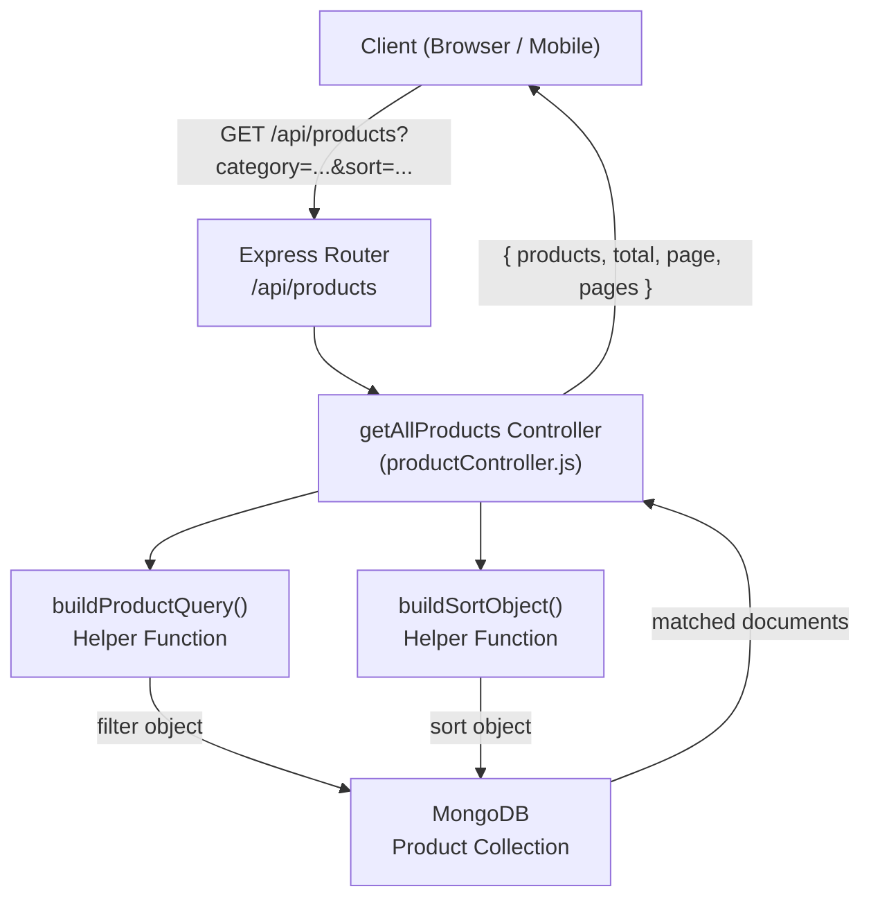
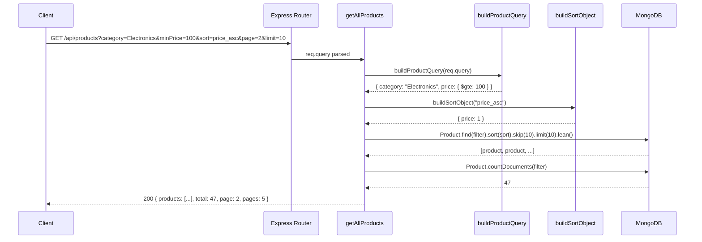
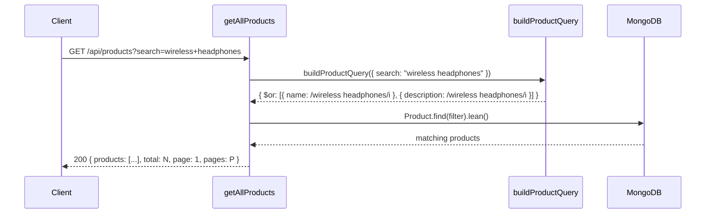
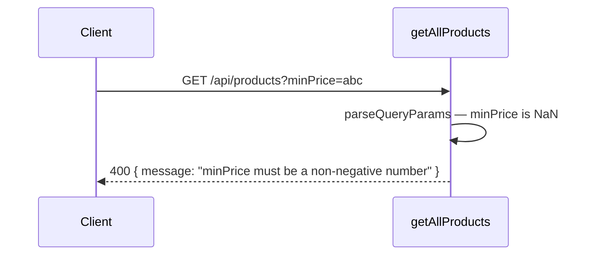

# Design Document: Product Filtering & Sorting

## Overview

This feature enhances the existing `GET /api/products` endpoint to support filtering by category, price range, minimum rating, and stock availability; sorting by price, rating, name, or creation date; full-text keyword search on name and description; and cursor-style pagination — all driven by query parameters. No new routes are introduced; the `getAllProducts` controller function is extended in-place.

The design follows the existing Express/MongoDB patterns in Techhub-v1: query parameters are parsed and validated in the controller, a MongoDB query object is built incrementally, and the result is returned as a JSON array alongside pagination metadata.

---

## Architecture



---

## Sequence Diagrams

### Happy Path — Filtered & Sorted Request



### Keyword Search Flow



### Validation Error Flow



---

## Components and Interfaces

### Component 1: `getAllProducts` Controller (enhanced)

**Purpose**: Entry point for the products listing endpoint. Parses and validates query parameters, delegates query/sort construction to helpers, executes the MongoDB query, and returns paginated results.

**Interface**:
```javascript
/**
 * @route   GET /api/products
 * @access  Public
 * @query   {string}  [search]    - Keyword search on name and description
 * @query   {string}  [category]  - Exact category match
 * @query   {number}  [minPrice]  - Minimum price (inclusive)
 * @query   {number}  [maxPrice]  - Maximum price (inclusive)
 * @query   {number}  [minRating] - Minimum rating (inclusive, 0–5)
 * @query   {boolean} [inStock]   - "true" returns only countInStock > 0
 * @query   {string}  [sort]      - One of: price_asc, price_desc, rating_asc,
 *                                  rating_desc, name_asc, name_desc,
 *                                  createdAt_asc, createdAt_desc
 * @query   {number}  [page]      - Page number, default 1
 * @query   {number}  [limit]     - Items per page, default 20, max 100
 */
async function getAllProducts(req, res, next): Promise<Response>
```

**Responsibilities**:
- Validate all incoming query parameters and return 400 on invalid values
- Delegate filter construction to `buildProductQuery`
- Delegate sort construction to `buildSortObject`
- Execute `Product.find(filter).sort(sort).skip(skip).limit(limit).lean()`
- Execute `Product.countDocuments(filter)` in parallel for total count
- Return `{ products, total, page, pages }` with HTTP 200

---

### Component 2: `buildProductQuery` Helper

**Purpose**: Translates validated query parameters into a MongoDB filter object. Keeps the controller clean and makes the query logic independently testable.

**Interface**:
```javascript
/**
 * @param {object} params - Validated query parameters
 * @param {string}  [params.search]
 * @param {string}  [params.category]
 * @param {number}  [params.minPrice]
 * @param {number}  [params.maxPrice]
 * @param {number}  [params.minRating]
 * @param {boolean} [params.inStock]
 * @returns {object} MongoDB filter object
 */
function buildProductQuery(params): object
```

**Responsibilities**:
- Build `$regex` conditions for keyword search
- Apply exact-match for category
- Build `$gte`/`$lte` range conditions for price
- Apply `$gte` for rating
- Apply `{ countInStock: { $gt: 0 } }` when `inStock` is true
- Return a plain object safe to pass directly to `Product.find()`

---

### Component 3: `buildSortObject` Helper

**Purpose**: Maps a sort string token (e.g. `"price_asc"`) to a MongoDB sort object (e.g. `{ price: 1 }`).

**Interface**:
```javascript
/**
 * @param {string} [sortParam] - Sort token from query string
 * @returns {object} MongoDB sort object, defaults to { createdAt: -1 }
 */
function buildSortObject(sortParam): object
```

**Responsibilities**:
- Map recognised sort tokens to `{ field: 1 | -1 }` objects
- Return `{ createdAt: -1 }` (newest first) for any unrecognised or absent value

---

## Data Models

### Query Parameter Schema

| Parameter  | Type    | Constraints                                                                 | Default |
|------------|---------|-----------------------------------------------------------------------------|---------|
| `search`   | string  | Non-empty after trim; max 200 chars                                         | —       |
| `category` | string  | Non-empty after trim; max 100 chars                                         | —       |
| `minPrice` | number  | ≥ 0; must be a finite number                                                | —       |
| `maxPrice` | number  | ≥ 0; must be a finite number; if both present, `maxPrice >= minPrice`       | —       |
| `minRating`| number  | 0 ≤ value ≤ 5                                                               | —       |
| `inStock`  | boolean | Only `"true"` activates the filter; any other value is ignored              | false   |
| `sort`     | string  | One of the 8 recognised tokens (see Component 3)                            | `createdAt_desc` |
| `page`     | integer | ≥ 1                                                                         | 1       |
| `limit`    | integer | 1 ≤ value ≤ 100                                                             | 20      |

### Response Schema

```javascript
{
  products: Product[],  // Array of product documents (lean)
  total:    number,     // Total matching documents (for client-side pagination UI)
  page:     number,     // Current page number
  pages:    number,     // Total number of pages: Math.ceil(total / limit)
}
```

### Product Document (existing schema — no changes)

```javascript
{
  _id:          ObjectId,
  name:         String,     // required
  price:        Number,     // required
  rating:       Number,     // default 0
  image:        String,     // required
  description:  String,
  category:     String,
  countInStock: Number,     // default 0
  createdAt:    Date,       // auto (timestamps)
  updatedAt:    Date,       // auto (timestamps)
}
```

---

## Algorithmic Pseudocode

### Main Controller Algorithm

```pascal
PROCEDURE getAllProducts(req, res, next)
  INPUT:  req.query — raw query string parameters
  OUTPUT: HTTP response with products and pagination metadata

  SEQUENCE
    // 1. Parse and validate query parameters
    validationResult ← validateQueryParams(req.query)
    IF validationResult.hasErrors THEN
      RETURN res.status(400).json({ message: validationResult.firstError })
    END IF

    params ← validationResult.parsed

    // 2. Build MongoDB filter and sort objects
    filter ← buildProductQuery(params)
    sort   ← buildSortObject(params.sort)

    // 3. Compute pagination offsets
    page  ← params.page  // default 1
    limit ← params.limit // default 20
    skip  ← (page - 1) * limit

    // 4. Execute DB queries in parallel
    [products, total] ← AWAIT Promise.all([
      Product.find(filter).sort(sort).skip(skip).limit(limit).lean(),
      Product.countDocuments(filter)
    ])

    // 5. Compute total pages
    pages ← CEIL(total / limit)

    // 6. Return response
    RETURN res.status(200).json({ products, total, page, pages })

  END SEQUENCE
END PROCEDURE
```

**Preconditions:**
- `req.query` is a plain object (Express guarantees this)
- MongoDB connection is established

**Postconditions:**
- Returns HTTP 400 if any parameter fails validation
- Returns HTTP 200 with `{ products, total, page, pages }` on success
- `products.length <= limit` always holds
- `total` reflects the count for the applied filter, not the full collection

**Loop Invariants:** N/A (no explicit loops in controller)

---

### buildProductQuery Algorithm

```pascal
PROCEDURE buildProductQuery(params)
  INPUT:  params — validated query parameter object
  OUTPUT: filter — MongoDB query filter object

  SEQUENCE
    filter ← {}

    // Keyword search: case-insensitive regex on name OR description
    IF params.search IS DEFINED THEN
      regex ← new RegExp(escapeRegex(params.search), 'i')
      filter.$or ← [
        { name:        { $regex: regex } },
        { description: { $regex: regex } }
      ]
    END IF

    // Category: exact match (case-sensitive, as stored)
    IF params.category IS DEFINED THEN
      filter.category ← params.category
    END IF

    // Price range
    IF params.minPrice IS DEFINED OR params.maxPrice IS DEFINED THEN
      filter.price ← {}
      IF params.minPrice IS DEFINED THEN
        filter.price.$gte ← params.minPrice
      END IF
      IF params.maxPrice IS DEFINED THEN
        filter.price.$lte ← params.maxPrice
      END IF
    END IF

    // Minimum rating
    IF params.minRating IS DEFINED THEN
      filter.rating ← { $gte: params.minRating }
    END IF

    // In-stock only
    IF params.inStock = true THEN
      filter.countInStock ← { $gt: 0 }
    END IF

    RETURN filter
  END SEQUENCE
END PROCEDURE
```

**Preconditions:**
- All numeric params have already been parsed to `Number` type
- `params.inStock` is a boolean (not the raw string `"true"`)
- `params.search` has been trimmed

**Postconditions:**
- Returns a valid MongoDB filter object
- An empty `params` object produces `{}` (matches all documents)
- Price sub-object is only added when at least one price bound is present
- `$or` is only added when `search` is present

**Loop Invariants:** N/A

---

### buildSortObject Algorithm

```pascal
PROCEDURE buildSortObject(sortParam)
  INPUT:  sortParam — string sort token (may be undefined)
  OUTPUT: sortObj   — MongoDB sort object

  SEQUENCE
    sortMap ← {
      "price_asc":      { price:     1  },
      "price_desc":     { price:    -1  },
      "rating_asc":     { rating:    1  },
      "rating_desc":    { rating:   -1  },
      "name_asc":       { name:      1  },
      "name_desc":      { name:     -1  },
      "createdAt_asc":  { createdAt: 1  },
      "createdAt_desc": { createdAt: -1 }
    }

    IF sortParam IS DEFINED AND sortMap[sortParam] EXISTS THEN
      RETURN sortMap[sortParam]
    ELSE
      RETURN { createdAt: -1 }   // default: newest first
    END IF
  END SEQUENCE
END PROCEDURE
```

**Preconditions:**
- `sortParam` is either undefined or a string

**Postconditions:**
- Always returns a non-empty MongoDB sort object
- Unrecognised tokens fall back to `{ createdAt: -1 }`

---

### validateQueryParams Algorithm

```pascal
PROCEDURE validateQueryParams(query)
  INPUT:  query — raw req.query object (all values are strings)
  OUTPUT: { hasErrors, firstError, parsed }

  SEQUENCE
    parsed ← {}
    errors ← []

    // search
    IF query.search IS DEFINED THEN
      s ← query.search.trim()
      IF s.length = 0 OR s.length > 200 THEN
        errors.push("search must be between 1 and 200 characters")
      ELSE
        parsed.search ← s
      END IF
    END IF

    // category
    IF query.category IS DEFINED THEN
      c ← query.category.trim()
      IF c.length = 0 OR c.length > 100 THEN
        errors.push("category must be between 1 and 100 characters")
      ELSE
        parsed.category ← c
      END IF
    END IF

    // minPrice
    IF query.minPrice IS DEFINED THEN
      n ← Number(query.minPrice)
      IF isNaN(n) OR n < 0 THEN
        errors.push("minPrice must be a non-negative number")
      ELSE
        parsed.minPrice ← n
      END IF
    END IF

    // maxPrice
    IF query.maxPrice IS DEFINED THEN
      n ← Number(query.maxPrice)
      IF isNaN(n) OR n < 0 THEN
        errors.push("maxPrice must be a non-negative number")
      ELSE
        parsed.maxPrice ← n
      END IF
    END IF

    // Cross-field: minPrice <= maxPrice
    IF parsed.minPrice IS DEFINED AND parsed.maxPrice IS DEFINED THEN
      IF parsed.minPrice > parsed.maxPrice THEN
        errors.push("minPrice must not exceed maxPrice")
      END IF
    END IF

    // minRating
    IF query.minRating IS DEFINED THEN
      n ← Number(query.minRating)
      IF isNaN(n) OR n < 0 OR n > 5 THEN
        errors.push("minRating must be a number between 0 and 5")
      ELSE
        parsed.minRating ← n
      END IF
    END IF

    // inStock
    parsed.inStock ← (query.inStock = "true")

    // sort
    VALID_SORTS ← ["price_asc","price_desc","rating_asc","rating_desc",
                   "name_asc","name_desc","createdAt_asc","createdAt_desc"]
    IF query.sort IS DEFINED AND query.sort NOT IN VALID_SORTS THEN
      errors.push("sort must be one of: " + VALID_SORTS.join(", "))
    ELSE
      parsed.sort ← query.sort  // may be undefined → default applied later
    END IF

    // page
    IF query.page IS DEFINED THEN
      n ← parseInt(query.page, 10)
      IF isNaN(n) OR n < 1 THEN
        errors.push("page must be a positive integer")
      ELSE
        parsed.page ← n
      END IF
    ELSE
      parsed.page ← 1
    END IF

    // limit
    IF query.limit IS DEFINED THEN
      n ← parseInt(query.limit, 10)
      IF isNaN(n) OR n < 1 OR n > 100 THEN
        errors.push("limit must be an integer between 1 and 100")
      ELSE
        parsed.limit ← n
      END IF
    ELSE
      parsed.limit ← 20
    END IF

    RETURN {
      hasErrors:  errors.length > 0,
      firstError: errors[0],
      parsed
    }
  END SEQUENCE
END PROCEDURE
```

**Preconditions:**
- `query` is a plain object where all values are strings or arrays of strings (Express default)

**Postconditions:**
- `parsed.page` and `parsed.limit` always have numeric defaults
- `parsed.inStock` is always a boolean
- If `hasErrors` is false, all numeric fields in `parsed` are valid JavaScript numbers
- Only the first error is surfaced to the client (fail-fast)

---

## Key Functions with Formal Specifications

### `getAllProducts(req, res, next)`

**Preconditions:**
- Express middleware chain has run; `req.query` is available
- MongoDB connection is live

**Postconditions:**
- On invalid params: responds with HTTP 400 and `{ message: string }`
- On success: responds with HTTP 200 and `{ products: Product[], total: number, page: number, pages: number }`
- `products.length <= parsed.limit`
- `pages === Math.ceil(total / parsed.limit)`
- Does not mutate any document in the database

---

### `buildProductQuery(params)`

**Preconditions:**
- All numeric fields in `params` are JavaScript `Number` (not strings)
- `params.inStock` is a `boolean`
- `params.search` is trimmed if present

**Postconditions:**
- `buildProductQuery({}) === {}` — empty params produce empty filter
- If `params.search` is set, result contains `$or` with two `$regex` entries
- If `params.minPrice` and `params.maxPrice` are both set, result contains `price: { $gte, $lte }`
- If only `params.minPrice` is set, result contains `price: { $gte }` (no `$lte` key)
- If `params.inStock === false`, `countInStock` key is absent from result

---

### `buildSortObject(sortParam)`

**Preconditions:**
- `sortParam` is `undefined` or a non-empty string

**Postconditions:**
- Return value is always a non-empty object with exactly one key
- For any unrecognised or absent `sortParam`, returns `{ createdAt: -1 }`
- For recognised tokens, the mapped field value is exactly `1` or `-1`

---

## Example Usage

### Filter by category and price range, sorted by price ascending

```
GET /api/products?category=Electronics&minPrice=50&maxPrice=500&sort=price_asc
```

```javascript
// Resulting MongoDB call (conceptual)
Product
  .find({ category: "Electronics", price: { $gte: 50, $lte: 500 } })
  .sort({ price: 1 })
  .skip(0)
  .limit(20)
  .lean()
```

Response:
```json
{
  "products": [ /* up to 20 documents */ ],
  "total": 34,
  "page": 1,
  "pages": 2
}
```

---

### Keyword search with in-stock filter, page 2

```
GET /api/products?search=wireless&inStock=true&page=2&limit=10
```

```javascript
Product
  .find({
    $or: [
      { name:        { $regex: /wireless/i } },
      { description: { $regex: /wireless/i } }
    ],
    countInStock: { $gt: 0 }
  })
  .sort({ createdAt: -1 })
  .skip(10)
  .limit(10)
  .lean()
```

---

### Sort by rating descending, minimum rating 3

```
GET /api/products?minRating=3&sort=rating_desc
```

```javascript
Product
  .find({ rating: { $gte: 3 } })
  .sort({ rating: -1 })
  .skip(0)
  .limit(20)
  .lean()
```

---

### No parameters — returns first page of all products, newest first

```
GET /api/products
```

```javascript
Product.find({}).sort({ createdAt: -1 }).skip(0).limit(20).lean()
```

---

## Error Handling

### Invalid numeric parameter

**Condition**: `minPrice`, `maxPrice`, `minRating`, `page`, or `limit` cannot be parsed as a valid number within its allowed range.
**Response**: HTTP 400 `{ "message": "minPrice must be a non-negative number" }`
**Recovery**: Client corrects the parameter and retries.

### Price range inversion

**Condition**: `minPrice > maxPrice` when both are provided.
**Response**: HTTP 400 `{ "message": "minPrice must not exceed maxPrice" }`
**Recovery**: Client swaps or corrects the values.

### Unrecognised sort token

**Condition**: `sort` query param is present but not in the allowed set.
**Response**: HTTP 400 `{ "message": "sort must be one of: price_asc, price_desc, ..." }`
**Recovery**: Client uses a valid sort token.

### MongoDB error

**Condition**: Database query throws (connection lost, timeout, etc.).
**Response**: Passed to Express global error handler via `next(err)` → HTTP 500 `{ "message": "Internal server error" }`
**Recovery**: Automatic — no state is mutated; client can retry.

### Empty result set

**Condition**: Filter matches zero documents.
**Response**: HTTP 200 `{ "products": [], "total": 0, "page": 1, "pages": 0 }`
**Recovery**: Not an error; client renders an empty state.

---

## Testing Strategy

### Unit Testing Approach

Test `buildProductQuery` and `buildSortObject` in isolation — they are pure functions with no I/O.

Key unit test cases for `buildProductQuery`:
- Empty params → `{}`
- `search` only → `$or` with two regex entries
- `category` only → `{ category: "..." }`
- `minPrice` only → `{ price: { $gte: N } }`
- `maxPrice` only → `{ price: { $lte: N } }`
- Both price bounds → `{ price: { $gte: N, $lte: M } }`
- `minRating` → `{ rating: { $gte: N } }`
- `inStock: true` → `{ countInStock: { $gt: 0 } }`
- `inStock: false` → no `countInStock` key
- All params combined → all keys present

Key unit test cases for `buildSortObject`:
- Each of the 8 valid tokens maps to the correct `{ field: direction }` object
- `undefined` → `{ createdAt: -1 }`
- Unknown string → `{ createdAt: -1 }`

Key unit test cases for `validateQueryParams`:
- Valid full params → `hasErrors: false`, all fields parsed correctly
- `minPrice: "abc"` → error message contains "minPrice"
- `minPrice: "100"`, `maxPrice: "50"` → cross-field error
- `minRating: "6"` → error
- `page: "0"` → error
- `limit: "200"` → error
- `sort: "invalid"` → error
- Missing optional params → defaults applied (`page: 1`, `limit: 20`, `inStock: false`)

### Property-Based Testing Approach

**Property Test Library**: fast-check

Properties to verify:

1. **Filter completeness**: For any valid params object, `buildProductQuery` returns an object where every key corresponds to a field in the Product schema or a MongoDB operator.

2. **Sort exhaustiveness**: For any string input, `buildSortObject` always returns an object with exactly one key whose value is `1` or `-1`.

3. **Pagination arithmetic**: For any `total >= 0` and `limit >= 1`, `pages === Math.ceil(total / limit)` holds.

4. **Validation idempotency**: Parsing already-valid parsed params through `validateQueryParams` again produces the same result.

5. **Empty filter safety**: `buildProductQuery({})` always returns `{}` regardless of how the empty object is constructed.

### Integration Testing Approach

Use an in-memory MongoDB instance (e.g. `mongodb-memory-server`) seeded with a fixed product set to verify end-to-end behaviour of the enhanced `getAllProducts` handler:

- Seeded categories: `["Electronics", "Clothing", "Books"]`
- Seeded price range: 10–1000
- Seeded ratings: 0–5
- Mix of in-stock and out-of-stock items

Integration test scenarios:
- `?category=Electronics` returns only Electronics products
- `?minPrice=100&maxPrice=300` returns only products in that price band
- `?inStock=true` returns only products with `countInStock > 0`
- `?search=pro` matches products whose name or description contains "pro" (case-insensitive)
- `?sort=price_asc` returns products in ascending price order
- `?page=2&limit=5` returns the correct slice and correct `total`/`pages` values
- Combined filters narrow results correctly
- No params returns all products with default pagination

---

## Performance Considerations

- **Parallel count query**: `Product.find()` and `Product.countDocuments()` are executed with `Promise.all` to avoid sequential round-trips.
- **`.lean()`**: Using Mongoose's `.lean()` returns plain JS objects instead of full Mongoose documents, reducing memory overhead for list responses.
- **Recommended indexes** (to be created as part of implementation):
  - `{ category: 1 }` — supports exact category filter
  - `{ price: 1 }` — supports range queries and price sort
  - `{ rating: -1 }` — supports rating filter and sort
  - `{ createdAt: -1 }` — supports default sort (likely already exists via `timestamps`)
  - `{ name: "text", description: "text" }` — MongoDB text index for keyword search (alternative to `$regex` for large collections; `$regex` is acceptable for small-to-medium datasets)
- **Regex search caveat**: `$regex` without a text index performs a full collection scan. For large product catalogues, migrating to a MongoDB text index (`$text: { $search: "..." }`) is recommended.
- **`limit` cap at 100**: Prevents clients from requesting unbounded result sets.

---

## Security Considerations

- **Regex injection**: User-supplied `search` strings are escaped before being compiled into a `RegExp` to prevent ReDoS attacks. An `escapeRegex` utility strips special regex metacharacters.
- **Parameter pollution**: Express parses duplicate query keys as arrays; the validator treats non-string values as invalid and returns 400.
- **No authentication required**: `GET /api/products` is a public route (consistent with existing behaviour). No changes to auth middleware.
- **Input length caps**: `search` (200 chars) and `category` (100 chars) are capped to prevent oversized inputs.

---

## Dependencies

No new npm packages are required. The implementation uses:

| Dependency | Already in project | Usage |
|---|---|---|
| `mongoose` | ✅ | `Product.find()`, `Product.countDocuments()` |
| `express` | ✅ | `req.query` parsing |

Optional (for testing only):
| Dependency | Purpose |
|---|---|
| `jest` or `vitest` | Unit and integration test runner |
| `mongodb-memory-server` | In-memory MongoDB for integration tests |
| `fast-check` | Property-based testing |
